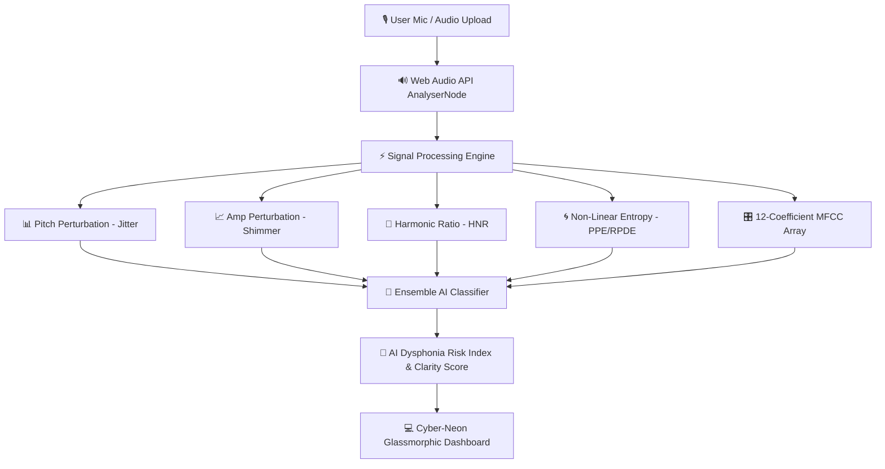

# 🧠 ParkinsonVoice — AI Vocal Biomarker & Signal Analysis System


**ParkinsonVoice** is an experimental voice-analysis demo. It includes local demo accounts, patient profiles, microphone recording, audio uploads, and session-history views. Its browser-only account system is not secure authentication, patient and audio records are not shared between browsers, and its heuristic prediction values are not clinical results.

> ⚠️ **Academic & Research Disclaimer:** ParkinsonVoice is an academic research platform designed for voice biomarker signal processing and experimental monitoring. Outputs do not constitute a formal clinical diagnosis. Always consult a licensed neurologist for medical evaluations.

> **Privacy warning:** Use synthetic test data only. Do not enter real patient-identifiable or medical information. Production use requires a secure authentication service, protected server-side database and file storage, access controls, backups, and appropriate privacy/compliance review.

---

## 🌟 Key Features

### 🎙️ 1. Live Voice Signal Phonation Studio
* **Real-time Web Audio API Capture**: Streams live microphone audio using browser `MediaStream` and `AudioContext` with zero latency.
* **48-Bar HTML5 Canvas Equalizer**: Interactive spectrum visualizer displaying frequency density, peak amplitude, and dynamic glowing cyan/magenta gradient bars.
* **Clinical Preset Phonation Tests**: Includes pre-packaged test procedures such as *Sustained Phononic /a/ Vowel*, *Rapid Syllables (/pa-ta-ka/)*, and *Pitch Glissando Sweep*.

### 📊 2. AI Dysphonia Risk Index Meter
* **360° Animated Radial SVG Gauge**: Visualizes computed AI Risk Index (0% – 100%) with color state transitions (*Low Risk - Emerald*, *Mild Variance - Amber*, *Elevated Biomarkers - Crimson*).
* **Neural Confidence Ratings**: Displays overall clarity scores and neural classifier model confidence.

### 🧬 3. High-Dimensional Acoustic Biomarker Matrix
Computes and visualizes essential vocal signal biomarkers:
* **Jitter (local)**: Measures cycle-to-cycle pitch frequency variation.
* **Shimmer (local)**: Measures cycle-to-cycle amplitude intensity perturbation.
* **Harmonics-to-Noise Ratio (HNR)**: Quantifies acoustic harmonic purity versus turbulent glottal noise (dB).
* **Pitch Period Entropy (PPE)**: Non-linear measure capturing dysphonic pitch fluctuations.
* **Recurrence Period Density Entropy (RPDE)**: Phase space recurrence complexity metric for vocal cord vibrations.
* **Detrended Fluctuation Analysis (DFA)**: Fractal scaling properties across speech duration windows.
* **12-Coefficient MFCC Matrix**: Interactive Mel-Frequency Cepstral Coefficients heatmap grid.

### 📈 4. Longitudinal Pitch Stability & Session History
* **Interactive Recharts Trend Chart**: Tracks 7-day phonation clarity scores, average stability, and jitter variance.
* **Clinical Audit Trail**: Searchable, risk-filtered database of past voice sessions with instant playback and deletion.
* **JSON Clinical Report Exporter**: One-click generation and download of structured JSON clinical summaries.

---

## 🔄 System Processing Architecture



---

## 🗂️ Project Directory Structure

```text
Frontend/
├── public/                     # Static public assets
├── src/
│   ├── assets/                 # App icons and media assets
│   ├── components/
│   │   ├── background/
│   │   │   └── ParticleBackground.jsx   # Aurora mesh canvas & particle node physics
│   │   ├── common/
│   │   │   ├── Header.jsx               # Breadcrumbs, status pill, search, disclaimer toggle
│   │   │   ├── Sidebar.jsx              # Navigation menu, user profile card, workspace pill
│   │   │   └── Footer.jsx               # Medical disclaimer, HIPAA compliance indicator
│   │   ├── voice/
│   │   │   ├── AudioRecorder.jsx        # Mic capture, MediaRecorder & signal trigger
│   │   │   ├── AudioUploader.jsx        # Drag & drop audio file ingestion
│   │   │   └── LiveAudioCanvas.jsx      # HTML5 Canvas 48-bar spectrum visualizer
│   │   ├── analytics/
│   │   │   ├── MLPredictionGauge.jsx    # 360° animated radial AI Risk meter
│   │   │   ├── AcousticMetricsGrid.jsx  # Biomarker cards with interactive info modals
│   │   │   ├── VocalTrendsChart.jsx     # Recharts longitudinal pitch stability graph
│   │   │   └── SpectrogramView.jsx      # 12-coefficient MFCC heatmap matrix
│   │   └── dashboard/
│   │       ├── OverviewTab.jsx          # Main overview dashboard tab
│   │       ├── VoiceLabTab.jsx          # Signal laboratory with real-time filters
│   │       ├── HistoryTab.jsx           # Session history table & JSON report export
│   │       ├── AIInsightsTab.jsx        # Neural classifier pipeline documentation
│   │       └── SettingsTab.jsx          # Microphone selection & sensitivity controls
│   ├── context/
│   │   └── VoiceAppContext.jsx          # Global React Context provider
│   ├── data/
│   │   ├── sampleRecordings.js          # Clinical test voice audio datasets
│   │   └── acousticKnowledge.js         # Reference thresholds for Jitter, Shimmer, HNR
│   ├── styles/
│   │   ├── variables.css                # Cyber-neon design tokens & glassmorphism
│   │   ├── animations.css               # Keyframe animations (glow, pulse, shimmer)
│   │   └── global.css                   # Global reset, typography, buttons, scrollbars
│   ├── utils/
│   │   └── audioAnalysis.js             # Web Audio autocorrelation pitch detection engine
│   ├── App.jsx                          # Main application layout shell
│   └── main.jsx                         # App entry point with Context Provider
├── index.html                           # HTML template with Google Fonts preconnect
├── package.json                         # Project dependencies & scripts
└── vite.config.js                       # Vite bundler configuration
```

---

## ⚡ Quick Start & Installation

### Prerequisites
* **Node.js**: v18.0.0 or higher
* **npm**: v9.0.0 or higher

### 1. Clone the Repository
```bash
git clone https://github.com/ganeshp2005/Parkinson-Voice.git
cd Parkinson-Voice
```

### 2. Install Dependencies
```bash
npm install
```

### 3. Launch Development Server
```bash
npm run dev
```
Open **`http://localhost:5173`** in your browser. Ensure microphone permissions are granted when prompted.

### Demo accounts

Use **Sign up** to create a local demo account. Account credentials and workspace data are stored in the current browser only; they do not create server-backed identities or synchronize across devices. The acoustic risk index is a heuristic demonstration, not a trained diagnostic model.

### GitHub Pages deployment

The repository includes a GitHub Actions workflow that builds and deploys the static app. Before its first deployment, a repository owner must sign in to GitHub and set **Settings → Pages → Build and deployment → Source** to **GitHub Actions**. Then push to `main` or manually run **Deploy to GitHub Pages** under the repository's Actions tab. The project URL is `https://ganeshp2005.github.io/Parkinson-Voice/` once the deployment succeeds.

---

## 🛠️ Build Commands

| Command | Action |
| :--- | :--- |
| `npm run dev` | Starts Vite local development server with HMR |
| `npm run build` | Compiles production assets into `dist/` |
| `npm run preview` | Previews the compiled production build locally |
| `npm run lint` | Runs `oxlint` code linter |

---

## 🔬 Acoustic Biomarker Reference Guide

| Metric | Reference Threshold | Description |
| :--- | :--- | :--- |
| **Jitter (local)** | `< 1.0%` | Frequency variation between consecutive vocal cord vibration cycles. |
| **Shimmer (local)** | `< 3.8%` | Amplitude variation between consecutive vocal sound waves. |
| **HNR** | `> 20 dB` | Harmonics-to-Noise ratio. Higher values indicate clear, pure phonation. |
| **PPE** | `< 0.15` | Pitch Period Entropy measuring non-linear pitch fluctuations. |
| **RPDE** | `< 0.45` | Recurrence Period Density Entropy measuring vocal complexity. |
| **DFA** | `0.50 - 0.70` | Detrended Fluctuation Analysis measuring fractal scaling in speech. |

---

## 🤝 Contributing

Contributions, issues, and feature requests are welcome! Feel free to check the [issues page](https://github.com/ganeshp2005/Parkinson-Voice/issues).

---

## 📄 License

Distributed under the MIT License. See `LICENSE` for more information.